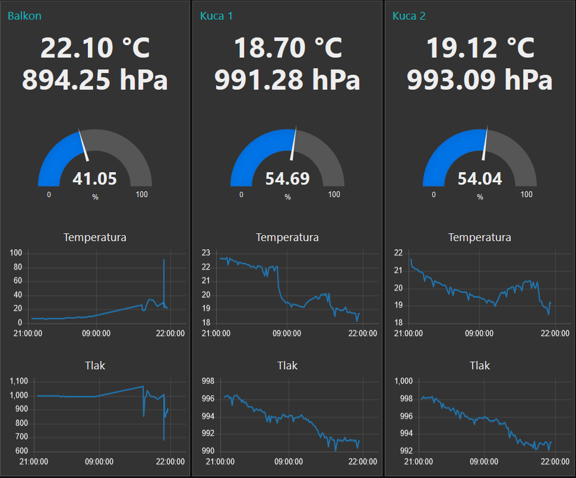
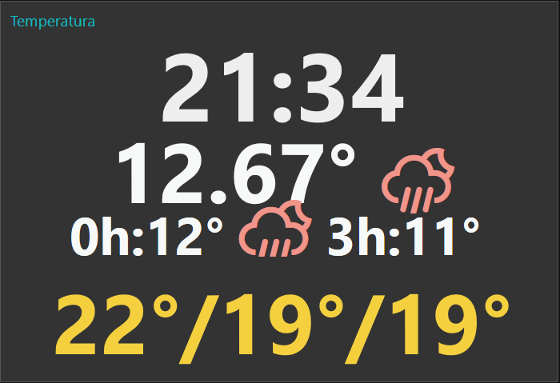
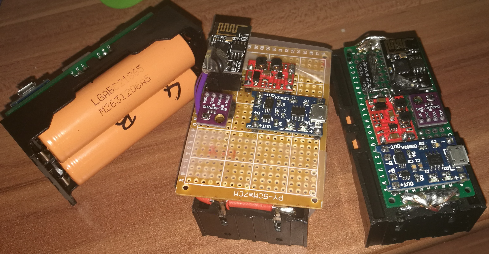

### Description 
This arduino program reads the weather, temperature and pressure from BME280, connects to the WiFi, then to MQTT server, publishes the data, and goes to deep sleep
Search for CHANGEME to change it

#### HW connection
[ESP8266 Deep sleep hardware connection](https://randomnerdtutorials.com/esp8266-deep-sleep-with-arduino-ide/) \
hint: ESP8266 ESP01 is easier to solder than ESP01s 

#### Board managers:
> ADD :: File -> Preferences -> Additional Boards Manager URLs: \
https://dl.espressif.com/dl/package_esp32_index.json, http://arduino.esp8266.com/stable/package_esp8266com_index.json 

> INSTALL :: Tools -> Board -> Boards Manager: \
esp8266 by ESP8266 Community \
esp32 by Espressif Systems

> INSTALL :: Sketch -> Include library -> Manage Libraries: \
BME280 by Tyler Glenn \
PubSubClient by Nick O'Leary

#### Parts used:
[LG 18650 from HP laptop](https://secondlifestorage.com/t-LG-LGABC21865-Cell-Specifications) \
[Buck-boost](https://www.aliexpress.com/item/DC-DC-Automatic-Buck-Boost-Power-Module-Input-3-15V-Output-3-3V-Step-Up-and/32892547111.html?spm=a2g0s.9042311.0.0.27424c4dCbtxDj) + buy 100uF electrolyte capacitor for output \
[μUSB 18650 battery charger](https://www.aliexpress.com/item/1PCS-5V-Micro-USB-1A-18650-Lithium-Battery-Charging-Board-With-Protection-Charger-Module/32477093293.html?spm=a2g0s.9042311.0.0.27424c4d83MFur) \
[ESP8266 ESP-01](https://www.aliexpress.com/store/product/KLV-40V300A-1-872-987-11-high-voltage-board-In-stock-Best-price-and-good-service/318950_603533808.html?spm=2114.12010615.8148356.38.5af5674dfENhfe) \
[BME280](https://www.aliexpress.com/store/product/3In1-BME280-GY-BME280-Digital-Sensor-SPI-I2C-Humidity-Temperature-and-Barometric-Pressure-Sensor-Module-1/318950_32817812439.html?spm=2114.12010615.8148356.2.399638af6pc0nf) \
[186500 Battery case](https://www.aliexpress.com/item/1Pc-Plastic-Battery-Case-Holder-Storage-Box-For-18650-Rechargeable-Battery-3-7V-DIY/32831018807.html?spm=a2g0s.9042311.0.0.27424c4d3SSB8Y) 

#### Node red:
 
